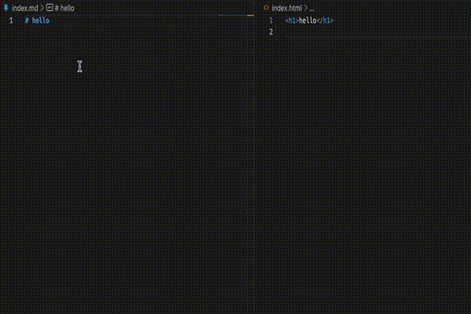

# gm2h


Generate markdown to HTML.

This program that automatically converts markdown files to HTML files when they are saved.

## Demo


## Install

```sh
cargo install --git https://github.com/shinshin86/gm2h.git
```

## Usage

```sh
# Create index.md
touch index.md

# Run gm2h
gm2h
```

Let's edit the markdown file.  
An generated HTML file is generated in the current directory.

directory can also be specified for use. See `--help` for details.

```sh
gm2h --help
```

## Use template file
gm2h supports [Handlebars](https://handlebarsjs.com).


As an example, create a template like this Write `{{{html}}}` where you want to embed the generated HTML.

The filename extension must be `hbs`.

example: `template.hbs`

```hbs
<!doctype html>
<html>
  <head>
    <title>Template sample</title>
  </head>
  <body>
    {{{html}}}
  </body>
</html>
```

Optionally specify the file path of the template file you created.

```sh
gm2h -t=template.hbs
```

### Template demo


## License
[MIT](https://github.com/shinshin86/gm2h/blob/main/LICENSE)

## Author
[Yuki Shindo](https://shinshin86.com/en)